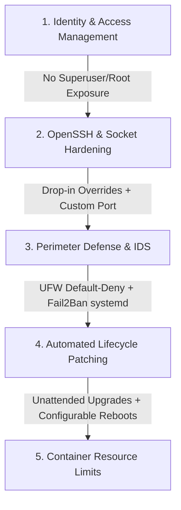

# Protocol: Linux Server Hardening & Security Baseline Specification

This document establishes the official security baseline and architectural standard for Linux Virtual Private Servers (VPS) across production environments. It guarantees a hardened perimeter, restricted identity access pathways, and automated maintenance cycles.

> [!NOTE]
> **Operational Automation**: For practical execution instructions, step-by-step automation workflows, parameter definitions (`vps.env`), and script runbooks, please consult the **[`scripts/OPERATIONAL_MANUAL.md`](file:///home/admilson/IdeaProjects/vps-hardening/scripts/OPERATIONAL_MANUAL.md)**.

---

## Architecture Overview & Security Layers



---

## 1. Identity & Access Management (IAM)

Direct superuser (`root`) exposure over network interfaces represents the primary vulnerability for brute-force and credential stuffing attacks. The standard requires an unprivileged administrative layer equipped with controlled `sudo` escalation rights.

### 1.1. User Provisioning & Escalation Policy
- **Requirement**: Administrative users must be provisioned non-interactively with dedicated home directories and default secure shells (`/bin/bash`).
- **Standard**:
  ```bash
  useradd -m -s /bin/bash vpsadmin
  usermod -aG sudo vpsadmin
  ```
  *(Note: `vpsadmin` is the default baseline username defined in [`scripts/vps.env`](file:///home/admilson/IdeaProjects/vps-hardening/scripts/vps.env).)*

### 1.2. Key-Based Authentication (`authorized_keys`)
- **Requirement**: All interactive shell access must use Public Key Infrastructure (PKI). Password authentication and root logins are strictly prohibited.
- **Standard**:
  ```bash
  mkdir -m 700 -p /home/vpsadmin/.ssh
  cp /root/.ssh/authorized_keys /home/vpsadmin/.ssh/authorized_keys
  chown -R vpsadmin:vpsadmin /home/vpsadmin/.ssh
  chmod 700 /home/vpsadmin/.ssh
  chmod 600 /home/vpsadmin/.ssh/authorized_keys
  ```

> [!IMPORTANT]
> **VERIFICATION BOUNDARY**: Never proceed to OpenSSH policy hardening without verifying that the unprivileged administrative user can authenticate cleanly via PKI and execute `sudo` commands.

---

## 2. OpenSSH & Socket Hardening

To ensure modularity and prevent upgrade conflicts on modern Ubuntu (24.04 LTS+) and Debian systems, direct regex mutations of `/etc/ssh/sshd_config` are superseded by clean drop-in overrides and systemd socket activation handling.

### 2.1. Drop-In Hardening Configuration (`/etc/ssh/sshd_config.d/`)
- **Standard**: Create `/etc/ssh/sshd_config.d/99-vps-hardening.conf` to enforce baseline rules:
  ```ini
  # Hardened Baseline Configuration
  Port your-preferred-ssh-port
  PermitRootLogin no
  PasswordAuthentication no
  KbdInteractiveAuthentication no
  ChallengeResponseAuthentication no
  MaxAuthTries 3
  ```
- **Validation**: Always execute `sshd -t` to verify configuration syntax prior to service reinitialization.

### 2.2. Systemd Socket Activation (`ssh.socket`)
- On modern Linux distributions where OpenSSH is managed via systemd sockets, modifying only `sshd_config` is insufficient because the socket unit controls listening ports.
- **Standard**: Deploy `/etc/systemd/system/ssh.socket.d/override.conf` overriding the default stream:
  ```ini
  [Socket]
  # Note: The empty ListenStream= line is strictly REQUIRED by systemd.
  # It clears the default port 22 before setting our custom port below.
  ListenStream=
  ListenStream=your-preferred-ssh-port
  ```

---

## 3. Perimeter Defense & Intrusion Detection

### 3.1. Uncomplicated Firewall (UFW) Baseline
- **Requirement**: The firewall must enforce a strict default-deny policy for incoming traffic while permitting essential egress communication.
- **Standard**:
  ```bash
  ufw default deny incoming
  ufw default allow outgoing
  ufw allow your-preferred-ssh-port/tcp comment 'Obfuscated SSH Port'
  ufw allow 80/tcp comment 'HTTP ACME Challenge/Redirects'
  ufw allow 443/tcp comment 'HTTPS Portal & API'
  ufw --force enable
  ```

### 3.2. Fail2Ban Orchestration
- **Requirement**: Automated IP ban rules for repetitive authentication failures.
- **Modern Compatibility**: On Ubuntu 24.04+ (using `systemd-journald` without legacy `rsyslog`), `/var/log/auth.log` is absent by default. Fail2Ban must be configured to consume systemd journal streams directly.
- **Standard (`/etc/fail2ban/jail.local`)**:
  ```ini
  [sshd]
  enabled = true
  port = your-preferred-ssh-port
  filter = sshd
  backend = systemd
  maxretry = 3
  bantime = 1h
  ```

---

## 4. Lifecycle & Patch Management

Automated security maintenance ensures that Common Vulnerabilities and Exposures (CVEs) are patched immediately upon release without manual operator intervention.

### 4.1. Unattended Security Upgrades (`/etc/apt/apt.conf.d/20auto-upgrades`)
- **Standard**:
  ```
  APT::Periodic::Update-Package-Lists "1";
  APT::Periodic::Unattended-Upgrade "1";
  ```

### 4.2. Controlled Maintenance Reboots (`/etc/apt/apt.conf.d/51unattended-upgrades-custom`)
- **Standard**: Allow automatic reboots **only** during off-peak maintenance windows whenever `/var/run/reboot-required` is flagged. To prevent reboots during business hours due to UTC defaults, the target timezone (`TIMEZONE`) and maintenance window (`REBOOT_TIME`) are configurable in `vps.env`:
  ```
  Unattended-Upgrade::Automatic-Reboot "true";
  Unattended-Upgrade::Automatic-Reboot-Time "04:30"; // Or custom REBOOT_TIME in your TIMEZONE
  ```

---

## 5. Container Resource Hardening (Docker)

To prevent containerized applications from causing disk exhaustion attacks via unbounded logging inside `/var/lib/docker/containers/`, global log rotation limits must be enforced on the daemon level.

### 5.1. Daemon Rotation Policy (`/etc/docker/daemon.json`)
- **Standard**:
  ```json
  {
    "log-driver": "json-file",
    "log-opts": {
      "max-size": "10m",
      "max-file": "3"
    }
  }
  ```

---

## 6. Target Metadata & Summary Posture

| Specification Parameter | Required Baseline Posture |
| :--- | :--- |
| **Architecture / OS** | x86_64 / Ubuntu 24.04 LTS (or compatible Debian/systemd OS) |
| **Identity Model** | Non-root `sudo` administrative user only (`vpsadmin` / configurable via `vps.env`) |
| **Authentication Policy** | PKI (`authorized_keys`) strictly mandatory (`PasswordAuthentication no`) |
| **OpenSSH Listening Port** | Obfuscated non-standard port (`your-preferred-ssh-port/tcp` / configured via `vps.env`) |
| **Network Perimeter** | UFW `default deny incoming`, whitelisted SSH, HTTP (80), HTTPS (443) |
| **Intrusion Prevention** | Fail2Ban `sshd` jail enabled via `backend = systemd` (Max 3 retries, 1h ban) |
| **Security Patching** | Automated daily `unattended-upgrades` with configurable `REBOOT_TIME` in local `TIMEZONE` |
| **Container Logging** | JSON file rotation bounded at `max-size: 10m` (`3` files max) |
