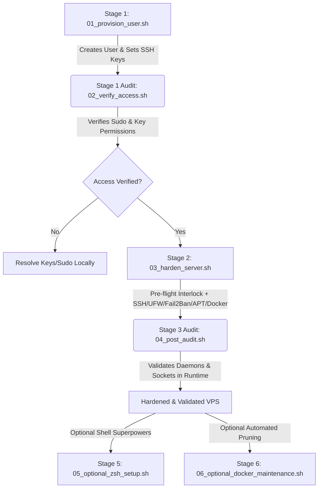

# Linux VPS Hardening & Security Baseline Suite — Operational Manual

This operational manual provides detailed step-by-step instructions, runbooks, and architectural diagrams for executing the automated hardening suite in any production Linux Virtual Private Server (VPS).

> [!IMPORTANT]
> **Formal Specification**: This manual governs the execution of the scripts. For the theoretical security baseline, policy justification, and compliance requirements, consult the root **[`../README.md`](file:///home/admilson/IdeaProjects/vps-hardening/README.md)**.

---

## Centralized Configuration (`vps.env`)

To make this suite completely environment-agnostic and reusable across multiple deployments without editing script code, all scripts automatically load baseline parameters from **[`vps.env`](file:///home/admilson/IdeaProjects/vps-hardening/scripts/vps.env)**:

```bash
# Target administrative username to create and grant sudo access
ADMIN_USER="vpsadmin"

# Source path for public SSH keys to inject into authorized_keys
PUBKEY_SOURCE="/root/.ssh/authorized_keys"

# Obfuscated SSH listening port for OpenSSH daemon and socket overrides (REQUIRED)
SSH_PORT="" # e.g. "your-preferred-ssh-port"

# System Timezone and local maintenance reboot window
TIMEZONE="America/Sao_Paulo"
REBOOT_TIME="04:30"
```

> [!TIP]
> **Precedence Rules**: You can edit `vps.env` once before running the suite, or you can override values on the fly by passing command-line arguments (`sudo ./01_provision_user.sh customuser`) or exporting environment variables (`ADMIN_USER=devops sudo -E ./01_provision_user.sh`).

---

## Architectural Workflow & Multi-Stage Execution

Executing server hardening in a single, monolithic pass creates a severe risk of **permanent administrative lockout** if public keys or sudo permissions are misconfigured. To guarantee operational safety, this suite divides the process into **discrete stages** with strict verification interlocks:



---

## Suite Component Inventory & Documentation

### 1. [`01_provision_user.sh`](file:///home/admilson/IdeaProjects/vps-hardening/scripts/01_provision_user.sh) *(Stage 1: Identity & Access Management)*
- **Purpose**: Provisions an unprivileged administrative user with `sudo` escalation capabilities and configures Public Key Infrastructure (PKI) authentication (`authorized_keys`), eliminating direct `root` access.
- **Key Capabilities**:
  - Non-interactive account creation (`useradd -m -s /bin/bash`) and `sudo` group membership assignment.
  - Automatically checks `/etc/shadow` and interactively prompts to set a secure Unix password (`passwd`) if the account lacks one, ensuring smooth execution of `sudo -v` during login verification.
  - Automatic injection of public keys from `ADMIN_USER_PUBKEY` (`vps.env`), `/root/.ssh/authorized_keys`, or a user-specified public key file.
  - Enforces strict OpenSSH directory/file permissions (`700` for `.ssh/` and `600` for `authorized_keys`).
- **Usage**:
  ```bash
  sudo ./01_provision_user.sh [username] [path_to_ssh_public_key]
  # Example overriding defaults: sudo ./01_provision_user.sh vpsadmin /root/.ssh/authorized_keys
  ```

---

### 2. [`02_verify_access.sh`](file:///home/admilson/IdeaProjects/vps-hardening/scripts/02_verify_access.sh) *(Stage 1 Audit: Pre-Hardening Check)*
- **Purpose**: Acts as an automated verification barrier before locking down root login and changing SSH listening ports. It confirms the target user account can successfully execute administrative tasks.
- **Key Capabilities**:
  - Validates user account existence and `sudo` group assignment.
  - Tests active command escalation privileges (`sudo -l -U <username>`).
  - Audits `/home/<username>/.ssh/authorized_keys` existence, non-emptiness, and file permissions (`<= 600`).
- **Usage**:
  ```bash
  sudo ./02_verify_access.sh [username]
  # Example: sudo ./02_verify_access.sh vpsadmin
  ```

---

### 3. [`03_harden_server.sh`](file:///home/admilson/IdeaProjects/vps-hardening/scripts/03_harden_server.sh) *(Stage 2: System & Network Hardening)*
- **Purpose**: Applies comprehensive system hardening across OpenSSH, UFW, Fail2Ban, APT `unattended-upgrades`, and Docker daemon configurations.
- **Key Capabilities**:
  - **Pre-flight Safety Interlock**: Scans system accounts before mutating OpenSSH configuration. If no non-root user with active `authorized_keys` and `sudo` rights is detected, the script aborts immediately to prevent permanent lockout.
  - **OpenSSH & Systemd Socket Hardening**:
    - Backs up existing config to `/etc/ssh/sshd_config.bak.<timestamp>`.
    - Deploys drop-in configuration overrides at `/etc/ssh/sshd_config.d/99-vps-hardening.conf` (disabling root login, disabling password authentication, and setting custom port `$SSH_PORT`).
    - Performs pre-reload syntax validation (`sshd -t`).
    - Automatically configures systemd socket activation (`ssh.socket` on Ubuntu 24.04+) at `/etc/systemd/system/ssh.socket.d/override.conf`.
  - **Perimeter Defense (UFW)**: Sets `default deny incoming` / `default allow outgoing`, whitelisting only the target SSH port, HTTP (`80`), and HTTPS (`443`).
  - **Fail2Ban IDS**: Configures `/etc/fail2ban/jail.local` monitoring the target SSH port with `backend = systemd` for native systemd-journald compatibility on Ubuntu 24.04.
  - **Automated Patch Management**: Pre-seeds non-interactive `unattended-upgrades` configuration, applies custom `TIMEZONE`, and schedules automatic security reboots at `REBOOT_TIME` when required by kernel updates.
  - **Docker Resource Limits**: Sets default container log rotation in `/etc/docker/daemon.json` (`max-size: 10m`, `max-file: 3`).
- **Usage**:
  ```bash
  sudo ./03_harden_server.sh [ssh_port] [--force]
  # Example: sudo ./03_harden_server.sh your-preferred-ssh-port
  ```

---

### 4. [`04_post_audit.sh`](file:///home/admilson/IdeaProjects/vps-hardening/scripts/04_post_audit.sh) *(Stage 3 Audit: Baseline Compliance Verification)*
- **Purpose**: Runs an exhaustive runtime compliance audit against the hardened server, testing actual daemon states rather than relying on static configuration files.
- **Key Capabilities**:
  - Validates `sshd -t` syntax and queries `sshd -T` effective runtime policies (`port`, `permitrootlogin no`, `passwordauthentication no`).
  - Checks listening network sockets using `ss -tulpn` to ensure the new SSH port is actively listening and standard port `22` is closed.
  - Verifies UFW active whitelists and Fail2Ban `sshd` jail status (`fail2ban-client status sshd`).
  - Audits `unattended-upgrades` and Docker log rotation configurations.
- **Usage**:
  ```bash
  sudo ./04_post_audit.sh [expected_ssh_port]
  # Example: sudo ./04_post_audit.sh your-preferred-ssh-port
  ```

---

### 5. [`05_optional_zsh_setup.sh`](file:///home/admilson/IdeaProjects/vps-hardening/scripts/05_optional_zsh_setup.sh) *(Stage 5 Optional: Shell & Productivity Suite)*
- **Purpose**: Safely installs and configures a developer-grade terminal environment (`zsh`, `oh-my-zsh`, themes, plugins, `zoxide`, `nvm`, and custom maintenance aliases) for the unprivileged administrative user without violating the security baseline.
- **Key Capabilities**:
  - Installs Zsh, Git, Curl, Zoxide, Htop, Ncdu, and Jq via system package repositories (`apt-get`).
  - Non-interactively clones Oh My Zsh into `/home/<user>/.oh-my-zsh` under the user's unprivileged execution context (`sudo -u <user>`).
  - Installs both **`spaceship-prompt`** and **`powerlevel10k`** themes along with **`zsh-autosuggestions`** and **`zsh-syntax-highlighting`** plugins.
  - Prepares Node Version Manager (**NVM**) inside `~/.nvm`.
  - Generates an optimized `~/.zshrc` equipped with instant prompt support, clean plugin loading (`git zsh-autosuggestions zsh-syntax-highlighting nvm`), `zoxide` initialization (`eval "$(zoxide init zsh)"`), and system maintenance aliases (`clear_swap`, `sys-upgrade`, `sys-purge`).
  - Safely changes the user's default login shell to `/bin/zsh` (`usermod -s /bin/zsh`).
- **Usage**:
  ```bash
  sudo ./05_optional_zsh_setup.sh [username]
  # Example: sudo ./05_optional_zsh_setup.sh vpsadmin
  ```

---

### 6. [`06_optional_docker_maintenance.sh`](file:///home/admilson/IdeaProjects/vps-hardening/scripts/06_optional_docker_maintenance.sh) *(Stage 6 Optional: Automated Docker Maintenance)*
- **Purpose**: Deploys an automated, conservative multi-stage pruning routine (`/usr/local/bin/docker-maintenance.sh`) and weekly cron schedule (`/etc/cron.d/docker-maintenance`) to prevent storage exhaustion (`No space left on device`) caused by build layers, dangling images, and stopped containers.
- **Key Capabilities**:
  - Checks if Docker is installed/active, but safely deploys the maintenance routine so any future Docker deployment is protected.
  - Installs `/usr/local/bin/docker-maintenance.sh` (`700` permissions) with a conservative pruning policy (`system prune -f`, `builder prune --until=168h`, and `image prune -a --until=336h`).
  - Preserves only images currently referenced by containers, while unreferenced tagged images older than 14 days may be removed by image prune (`-a` is avoided in system prune, and image prune enforces a 14-day window).
  - Records disk usage before and after cleanup inside `/var/log/docker-maintenance.log`.
  - Configures weekly log rotation at `/etc/logrotate.d/docker-maintenance` (retains 4 weeks compressed).
  - Schedules execution every Sunday at 04:00 AM via `/etc/cron.d/docker-maintenance`.
- **Usage**:
  ```bash
  sudo ./06_optional_docker_maintenance.sh
  ```

---

## Step-by-Step Operator Runbook

Follow this precise sequence when deploying on a newly provisioned VPS:

1. **Initial Access**: Connect to your target VPS as `root` via standard SSH (Port 22):
   ```bash
   ssh root@<target-vps-ip>
   ```

2. **Install Git & Clone Repository**: On minimal VPS images, install `git` first, clone the repository, and enter the `scripts/` directory:
   ```bash
   apt update && apt install -y git
   git clone <your-repository-url> vps-hardening
   cd vps-hardening/scripts
   chmod +x *.sh
   ```

3. **Optional - Customize Environment Defaults**:
   Review or modify [`vps.env`](file:///home/admilson/IdeaProjects/vps-hardening/scripts/vps.env) to set your desired `ADMIN_USER`, `PUBKEY_SOURCE`, and `SSH_PORT`:
   ```bash
   nano vps.env
   ```

4. **Stage 1 Execution — Provision User**:
   ```bash
   ./01_provision_user.sh
   ```

4.1 **Injecting Public Keys (Required if Logged in via Password or deploying unique keys)**:
   If you initially accessed `root` via password, `/root/.ssh/authorized_keys` is empty, and `01_provision_user.sh` will warn that no keys were injected. You **must** populate your public SSH key before verifying access (`02_verify_access.sh`):
   - **Method A (From your local workstation terminal in a new tab)**:
     ```bash
     ssh-copy-id vpsadmin@<target-vps-ip>
     ```
   - **Method B (Declarative Infrastructure-as-Code via `vps.env`)**:
     Open `vps.env`, set your public key string inside `ADMIN_USER_PUBKEY="ssh-ed25519 AAA..."`, and re-run `./01_provision_user.sh` to inject it automatically:
     ```bash
     nano vps.env
     ./01_provision_user.sh
     ```

5. **Stage 1 Audit — Verify User Access & Keys**:
   ```bash
   ./02_verify_access.sh
   ```

6. **CRITICAL VERIFICATION CHECKPOINT**:
   Open a **new terminal tab/window on your local workstation** and confirm you can log in as your configured user (e.g. `vpsadmin`) and execute `sudo`:
   ```bash
   ssh -p 22 vpsadmin@<target-vps-ip>
   sudo -v
   ```
   > [!WARNING]
   > **DO NOT PROCEED TO STAGE 2 UNTIL THIS CHECK SUCCEEDS.** If you cannot log in via SSH keys or cannot use `sudo`, troubleshoot your local SSH agent or key permissions before continuing.

7. **Stage 2 Execution — Apply Hardening Baseline**:
   Execute from your verified session or root terminal:
   ```bash
   sudo ./03_harden_server.sh
   ```

8. **Stage 3 Execution — Run Post-Hardening Compliance Audit**:
   ```bash
   sudo ./04_post_audit.sh
   ```

9. **Stage 5 Execution (Optional) — Install Zsh, OMZ & Productivity Suite**:
   Give your administrative user the superpower shell baseline:
   ```bash
   sudo ./05_optional_zsh_setup.sh
   ```

10. **Stage 6 Execution (Optional) — Automated Docker Maintenance**:
    Install conservative weekly Docker pruning and build cache maintenance:
    ```bash
    sudo ./06_optional_docker_maintenance.sh
    ```

11. **Final Verification**:
    Test connecting from your local workstation using the new obfuscated SSH port. You will land directly in your hardened, supercharged Zsh terminal:
    ```bash
    ssh -p your-preferred-ssh-port vpsadmin@<target-vps-ip>
    ```

---

## Troubleshooting & Rollback Procedures

- **Locked out of root / password login?**
  If Stage 2 was applied (`03_harden_server.sh`), `root` login and passwords are disabled. You must log in via your configured administrative user (`vpsadmin`) using your SSH private key on `your-preferred-ssh-port` (or your configured `SSH_PORT`).
- **Reverting SSH Configuration Check Failure**:
  If `sshd -t` fails during Stage 2, `03_harden_server.sh` automatically deletes `/etc/ssh/sshd_config.d/99-vps-hardening.conf` and restores the backup configuration (`/etc/ssh/sshd_config.bak.<timestamp>`).
- **Emergency Console Recovery**:
  If firewall or SSH rules block your access, log in using your cloud provider's Out-Of-Band (OOB) web console (VNC / Serial Console) and run:
  ```bash
  sudo ufw disable
  sudo rm -f /etc/ssh/sshd_config.d/99-vps-hardening.conf
  sudo rm -f /etc/systemd/system/ssh.socket.d/override.conf
  sudo systemctl daemon-reload
  sudo systemctl restart ssh.socket || sudo systemctl restart ssh.service
  ```
